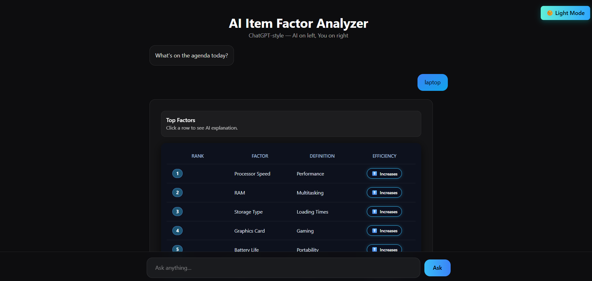
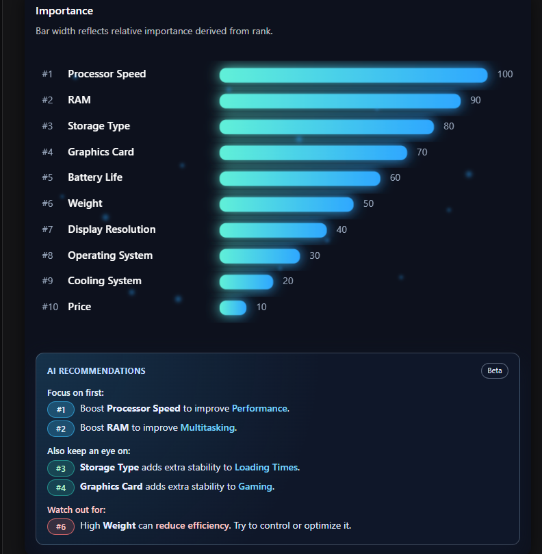
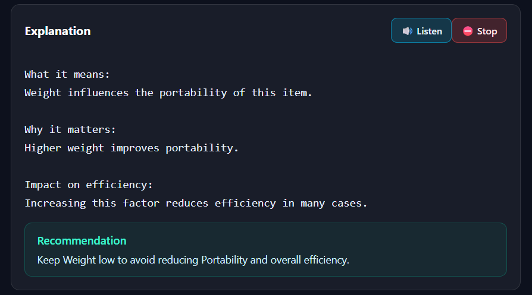

<p align="center">
  
</p>


# 🌐 AI Item Factor Analyzer

Introducing a web app that breaks down **any item** (laptop, phone, course, etc.) into its **top factors**, explains them in plain language, and shows **visual importance charts**.

- 💬 Chat-style interface — AI on left, you on right  
- 📊 Beautiful factor importance graph  
- 🔌 FastAPI + Groq on the backend  
- ⚛️ Next.js + TypeScript on the frontend  
- ☁️ Backend deployed on **Render**, frontend on **Vercel**  
- 🧠 Designed to be easy for beginners to run & deploy

---

## 🚀 Live Demo

> 🔗 **Frontend:** https://ai-item-factors.vercel.app/  
> 🟣 **Backend API:** https://ai-item-factors.onrender.com

_after entering the item in AI website wait for some time to produce output , because i used free instance in render it may take > 50s ._
_open is desktop site for a better experience and UI._

---

## 🧱 Tech Stack

**Frontend**

- Next.js 14 (App Router)
- TypeScript
- Tailwind CSS
- WebSockets (for live streaming of factor results)

**Backend**

- Python 3.13
- FastAPI
- Uvicorn
- Groq API (for LLM)
- WebSockets (FastAPI)

**Infrastructure**

- GitHub (source control)
- Render (Python web service for backend)
- Vercel (Next.js hosting for frontend)

---

## 🗂 Project Structure

```bash
AI-ITEM-FACTORS/
├── backend/
│   ├── app/
│   │   ├── api/
│   │   │   ├── query.py          # REST endpoint to start factor analysis
│   │   │   └── websocket.py      # WS endpoint to stream factors
│   │   ├── services/
│   │   │   ├── item_service.py   # Item factor logic
│   │   │   └── llm_service.py    # Groq/OpenAI wrapper
│   │   └── workers/
│   │       └── tasks.py          # Background tasks (if any)
│   ├── requirements.txt          # Python dependencies
│   └── uvicorn.json              # Uvicorn config for Render
│
├── frontend/
│   ├── app/
│   │   ├── page.tsx              # Protected home page (chat UI)
│   │   ├── HomePage.tsx          # Main chat + chart UI
│   │   ├── login/page.tsx        # Login page (Firebase)
│   │   ├── signup/page.tsx       # Signup page (Firebase)
│   │   ├── context/AuthContext.tsx   # Auth provider (Firebase)
│   │   └── components/           # UI components
│   ├── utils/
│   │   ├── api.ts                # Calls backend REST endpoints
│   │   └── socket.ts             # WebSocket client
│   ├── styles/globals.css        # Global styles (Apple-style font stack, etc.)
│   ├── firebaseConfig.ts         # Firebase config
│   ├── package.json              # Frontend dependencies & scripts
│   └── tsconfig.json
│
└── README.md                     # You are here
```
----
# 🛠 Local Development
## 1. Clone the Repo
```
git clone https://github.com/GoondlaBalaji/AI-ITEM-FACTORS.git
cd AI-ITEM-FACTORS
```
## 2. Backend Setup (FastAPI + Groq)
```
cd backend
python -m venv .venv

# Windows
.venv\Scripts\activate

# macOS / Linux
# source .venv/bin/activate

pip install -r requirements.txt
```

- Create a .env file inside backend/:
```
backend/.env
```
```
GROQ_API_KEY=your_groq_api_key_here
ALLOWED_ORIGIN=https://ai-item-factors.vercel.app/
```

- Run the backend locally:
```
uvicorn app.main:app --reload
```

Backend should now be running at:
http://127.0.0.1:8000

## 3. Frontend Setup (Next.js)

In another terminal:
```
cd frontend
npm install
```

- Create .env.local in frontend/:
```
NEXT_PUBLIC_API_URL=http://127.0.0.1:8000
NEXT_PUBLIC_WS_URL=ws://127.0.0.1:8000/ws
NEXT_PUBLIC_API_BASE_URL=http://127.0.0.1:8000
```


- Run the dev server:
```
npm run dev
```

- Now open:
http://localhost:3000

You should see the AI Item Factor Analyzer UI.

---
# ☁️ Deployment Guide
## 1️⃣ Push to GitHub

- From the project root:
```
git add .
git commit -m "Initial AI Item Factor Analyzer"
git branch -M main
git remote add origin https://github.com/GoondlaBalaji/AI-ITEM-FACTORS.git
git push -u origin main
```

## 2️⃣ Deploy Backend on Render

- Go to https://dashboard.render.com

- New → Web Service

- Connect your GitHub and select AI-ITEM-FACTORS repo

- Settings:
 
  - Root Directory: backend

  - Environment: Python 3

  - Build Command: pip install -r requirements.txt

  - Start Command:

  - ```uvicorn app.main:app --host 0.0.0.0 --port 10000```


  - Environment Variables:

    - GROQ_API_KEY=your_groq_key


Click Create Web Service

Render will build, install requirements.txt, and then show a live URL like:

- https://ai-item-factors.onrender.com

## 3️⃣ Deploy Frontend on Vercel

- Go to https://vercel.com

- New Project → Import from GitHub

- Choose AI-ITEM-FACTORS

- In “Root Directory” choose: frontend

- Framework will auto-detect Next.js

- Environment Variables (copy from .env.local):

  - ```NEXT_PUBLIC_API_URL=https://ai-item-factors.onrender.com```
  - ```NEXT_PUBLIC_WS_URL=wss://ai-item-factors.onrender.com/ws```
  - ```NEXT_PUBLIC_API_BASE_URL=https://ai-item-factors.onrender.com```


Click Deploy

Vercel will give you a URL like:

https://ai-item-factors.vercel.app

Now your frontend talks to the Render backend in the cloud.


---
# 📸 Screenshots


### Main Chat UI with Factor Breakdown

### Graph and Recommendations

### Explanation with audio 


---
# 🧑‍💻 For Beginners: Mental Model

- GitHub = your code storage & history

- Render = runs your Python backend 24/7

- Vercel = serves your Next.js frontend to the browser

- Env files (.env) = secret keys & URLs (never commit real keys)

Flow:

- You write code locally

- You git push → GitHub

- Render + Vercel automatically pull that code and redeploy

- Users visit your Vercel URL and the site calls Render’s API

---
# 🤝 Contributing / Ideas

Things you (or others) can add next:

- 🔐 Proper login / signup flow (Firebase Auth)

- 💾 Chat history (PostgreSQL, Firebase Firestore, or Supabase) --> i am working on it

- 📤 Image upload + visual factor analysis

- 🌓 Theme toggle (dark / light)

- 📈 Analytics (PostHog / Vercel Analytics)

PRs / issues are welcome once this repo is public.
---
# ⭐ If You Like This

If you’re checking this from my GitHub profile:

- Drop a ⭐ on the repo

- Fork it and build your own version

- Use this as a template for your own AI-powered analysis tools
